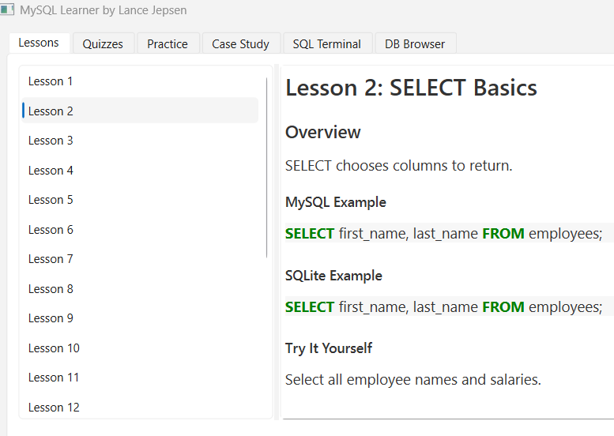
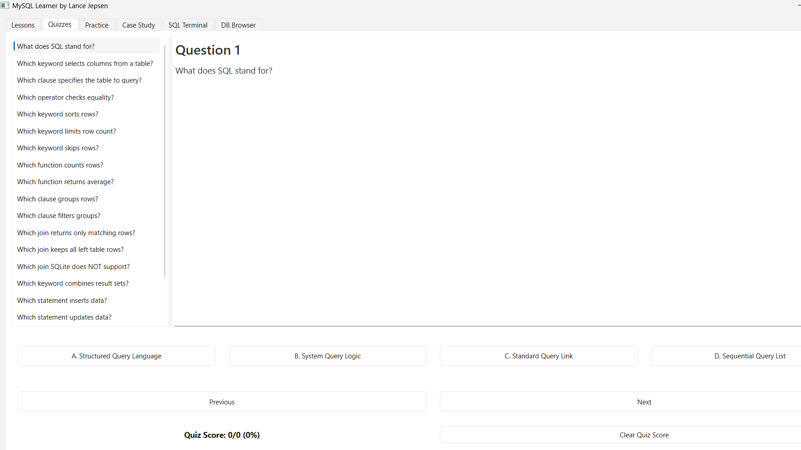
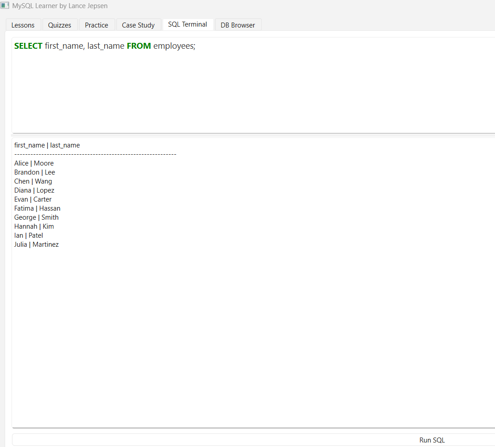

# 🧠 MySQL Learner  by Lance Jepsen
### Interactive SQL Learning App • Lessons • Quizzes • Practice Mode • SQLite Terminal • DB Browser

[]()
[](https://github.com/lancejepsen/MySQL-Learner/releases)
[]()
[]()
[]()

---

## 🚀 Overview

**MySQL Learner** is a desktop learning application designed to help beginners understand SQL fundamentals using a guided, interactive environment.

The app includes:

- ✔ 20 full beginner SQL lessons (Markdown format)  
- ✔ 20 auto-graded multiple-choice quizzes  
- ✔ 20 hands-on SQL practice problems  
- ✔ A complete SQL case study with hidden answers  
- ✔ A built-in **SQLite DB Browser**  
- ✔ A full **SQL Terminal** that executes real queries against `sample.db`  
- ✔ Dynamic layout, maximized window, and EXE-safe file loading  
- ✔ Fully offline — no internet required  

Ideal for:

- SQL beginners  
- Data analysts in training  
- Bootcamp students  
- Professionals learning SQL Lite / MySQL basics  
- Anyone preparing for interviews  

---

## 📥 **Download MySQL Learner (Windows Installer)**

👉 **Latest Release:**  
https://github.com/lancejepsen/MySQL-Learner/releases/latest

Download the file:

```
MySQL_Learner_Installer.exe
```

Run the installer and the application will appear in:

```
Start Menu → MySQL Learner
```

(Optional) It also creates a desktop shortcut.

---

## 🖼️ App Screenshots






---

## 📚 Features

### 🎓 Lessons (20 Beginner SQL Lessons)
- SQL basics  
- SELECT, WHERE, ORDER BY  
- JOINs  
- GROUP BY / HAVING  
- Subqueries  
- Aggregates  
- SQLite differences vs MySQL  

### 📝 Quizzes (20 auto-graded)
- Fully interactive  
- Tracks score  
- Supports next/previous navigation  
- Reset score anytime  

### 🔧 Practice Mode
- Loads all 20 JSON-based practice problems  
- Hidden answers until “Show Answer” is clicked  
- Shows MySQL and SQLite versions side-by-side  

### 🏗️ Case Study Module
- Real-world HR analytics scenario  
- 10 multi-step tasks  
- Answers are hidden until user toggles visibility  

### 🖥️ SQL Terminal
- Execute real SQL queries against the included `sample.db`  
- Supports SELECT, INSERT, UPDATE, DELETE, JOIN, GROUP BY, etc.  

---

## 🗂️ Project Structure

```
MySQL Learner/
│   MySQL_Learner.py
│   README.md
│   requirements.txt
│   installer.iss
│   mysql_learner.log
│
├── ui/
├── lessons/
├── quizzes/
├── practice/
├── case_study/
├── database/
│
└── dist/
    └── MySQL_Learner.exe
```

---

## 🛠️ Development Setup

### 1. Create virtual environment
```bash
python -m venv .venv
```

### 2. Activate venv
**Windows:**
```bash
.\.venv\Scriptsctivate
```

### 3. Install dependencies
```bash
pip install -r requirements.txt
```

### 4. Run application
```bash
python MySQL_Learner.py
```

---

## 🧱 Building the EXE (PyInstaller)

```powershell
.\.venv\Scripts\python.exe -m PyInstaller `
    --noconfirm `
    --onefile `
    --windowed `
    --add-data "lessons;lessons" `
    --add-data "quizzes;quizzes" `
    --add-data "practice;practice" `
    --add-data "case_study;case_study" `
    --add-data "database;database" `
    MySQL_Learner.py
```

EXE appears in:

```
dist\MySQL_Learner.exe
```

---

## 📦 Building Installer (Inno Setup)

Open:

```
installer\installer.iss
```

Click **Build → Compile**.

Installer output:

```
MySQL_Learner_Installer.exe
```

---

## 📄 License

MIT License  
© 2025 by Lance Jepsen 
